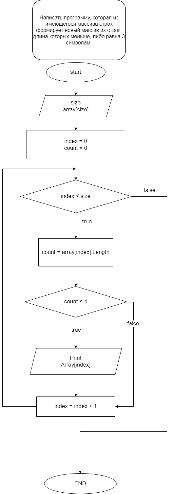

# Итоговая проверочная работа
## Задача:
Написать программу, которая из имеющегося массива строк формирует массив из строк, длина которых меньше либо равна 3 символа. Первоначальный массив можно ввести с клавиатуры, либо задать на старте выполнения алгоритма. При решении не рекомендуется пользоваться коллекциями, лучше обойтись исключительно массивами.

### Алгоритм решения:
+ создаем массив;
+ заполняем массив строками (ввод в консоли);
+ производим подсчета количества элементов в массиве, длина которых меньше либо равна 3 символа;
+ создаем новый массив размером, равным количеству подсчитанных элементов;
+ заполняем новый массив элементами, длина которых меньше либо равна 3 символа;
+ новый массив.

### Блок-схема алгоритма:
 